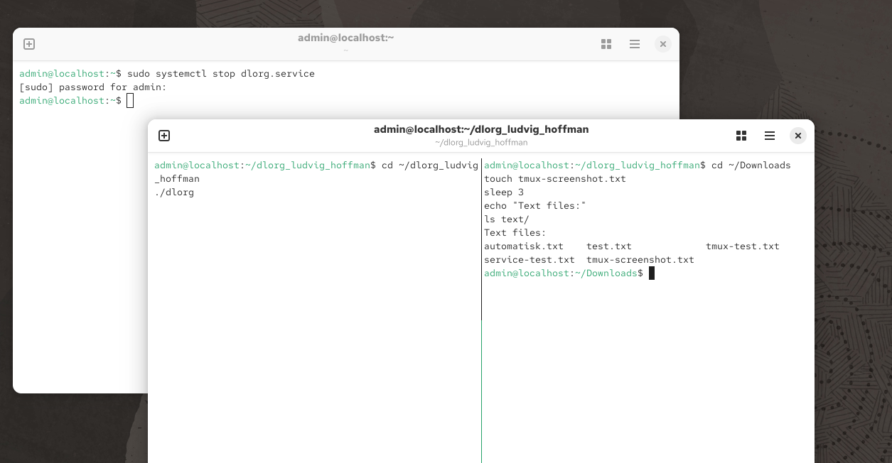
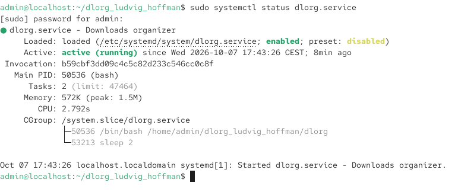

# Downloads Organizer

A Bash script that automaticaly organizes files in the Downloads directory based on file sort.

The script continuously checks the downloads directory and moves files into different folders depending on their file extension.

Files are sorted into:

- text - .txt
- pdfs - .pdf
- images - .jpg, .jpeg, .png
- docs - .doc, .docx
- videos - .mp4, .mov
- archives - .zip
- other - all other file types

The folders are automatically created if they do not exist.

## Run the script

Give the script permission to execute:

```
bash
chmod +x dlorg
```

Run the script with:

```
bash
./dlorg
```

Stop the script with Ctrl+C.

## Testing

The script was tested using tmux. The script was running in one panel while files were created and moved into Downloads from another panel

For example:

```
bash
touch ~/Downloads/test.txt
```

The file is automatically moved to:

```
text
~/Downloads/text/test.txt
```


## Deleted directories

If one of the sorting directories is deleted while the script is running, the directory is automatically created again.

This was tested by deleting the images directory and then adding a PNG file. The images directory was recreated and the PNG file was sorted into it.

## Background service

The script can also run automatically in the background using systemd.

The included dlorg.service file can be used to start the script automatically.

```
bash
sudo systemctl enable dlorg.service
sudo systemctl start dlorg.service
```

The service can be checked with:

```
bash
sudo systemctl status dlorg.service
```

## AI usage

I used an LLM as a support tool during the assignment for help with Bash syntax, troubleshooting and explanations of commands and help with explaining the process in this README


## Screenshots

### File sorting


### Testing with tmux



### Background service


